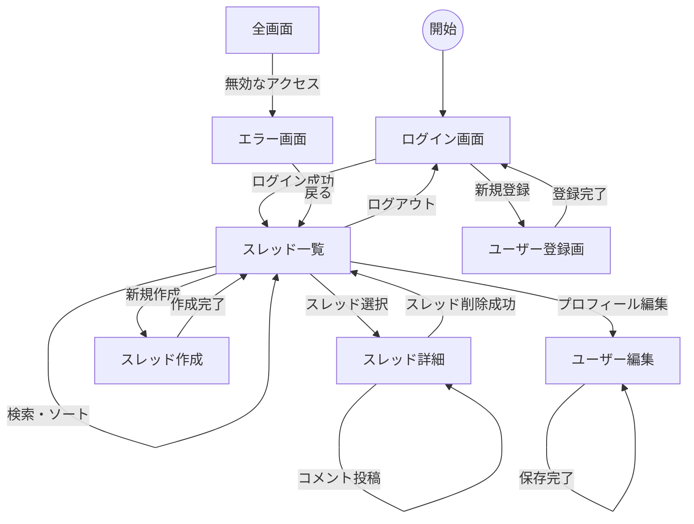

# 画面設計書

## 1. 画面一覧

| ID | 画面名 | パス (例) | 概要 |
| :--- | :--- | :--- | :--- |
| P01 | ログイン画面 | `/login` | ユーザー認証を行う。未ログイン時のランディングページ。 |
| P02 | ユーザー登録画面 | `/register` | 新規アカウントを作成する。 |
| P03 | スレッド一覧画面 | `/` | 投稿されたスレッドを一覧表示する（ログイン必須）。 |
| P04 | スレッド詳細画面 | `/threads/:id` | スレッド内容とコメントを表示・投稿する。 |
| P05 | スレッド作成画面 | `/threads/new` | 新規スレッドを投稿する。 |
| P06 | ユーザー編集画面 | `/profile/edit` | 表示名の変更を行う。 |
| P07 | エラー画面 | - | 404エラーや削除済みアクセス時に表示する。 |

---

## 2. 各画面定義

### P01: ログイン画面
- **目的**: 既存ユーザーを認証し、アプリを利用可能にする。
- **入力項目**:
    - ユニークID (テキスト入力)
    - パスワード (パスワード入力)
- **アクション**:
    - [ログイン] ボタン: 認証成功で P03 へ、失敗でエラーメッセージ表示。
    - [新規登録画面へ] リンク: P02 へ遷移。

### P02: ユーザー登録画面
- **目的**: 新規ユーザーアカウントを作成する。
- **入力項目**:
    - ユニークID (テキスト入力) ※重複不可
    - パスワード (パスワード入力) ※12文字以上、英数字記号混在
    - 表示名 (テキスト入力) ※15文字以内
- **アクション**:
    - [登録] ボタン: バリデーション成功で P01 へ遷移。失敗で各フィールドにエラー表示。

### P03: スレッド一覧画面
- **目的**: 投稿された全スレッドを閲覧・検索・ソートする。
- **主要要素**:
    - 検索窓 (テキスト入力) + [検索] ボタン
    - ソート切替 (セレクトボックス): 「作成日時順」「コメント数順」「最終更新日時順」
    - [新規スレッド作成] ボタン: P05 へ遷移。
- **スレッドカード表示内容**:
    - タイトル (リンク: P04へ遷移)
    - 本文冒頭
    - 作成者、作成日時、コメント数、最終更新日時
- **ページネーション**:
    - [前に戻る] [次に進む] ボタン (1ページ10件表示)

### P04: スレッド詳細画面
- **目的**: 特定の話題の詳細確認と、コメントによる対話を行う。
- **スレッド表示項目**:
    - タイトル、本文全文、作成者、作成日時
    - [スレッドを削除する] ボタン: ※作成者かつコメント0件時のみ表示
- **コメント一覧**:
    - 本文、作成者、作成日時
    - [削除] ボタン: ※自分のコメントのみ。クリックで文言置換。
- **コメント投稿**:
    - 本文 (テキストエリア)
    - [送信] ボタン: 投稿後、P04を再読み込み。

### P05: スレッド作成画面
- **目的**: 新しいスレッドを投稿する。
- **入力項目**:
    - タイトル (テキスト入力)
    - 本文 (テキストエリア)
- **アクション**:
    - [作成] ボタン: 成功後、P03へ遷移。

### P06: ユーザー編集画面
- **目的**: 自身の表示名を変更する。
- **入力項目**:
    - 表示名 (テキスト入力) ※15文字以内。初期値は現在の名前。
- **アクション**:
    - [保存] ボタン: 成功後、ヘッダー等の表示が更新されメッセージを表示。

### P07: エラー画面
- **目的**: 無効なアクセスに対するフィードバック。
- **表示内容**:
    - 「404 Not Found」または「ご指定のスレッドは見つかりません」といったメッセージ。
    - [トップページへ戻る] リンク: P03 へ。

---

## 3. 画面遷移図

